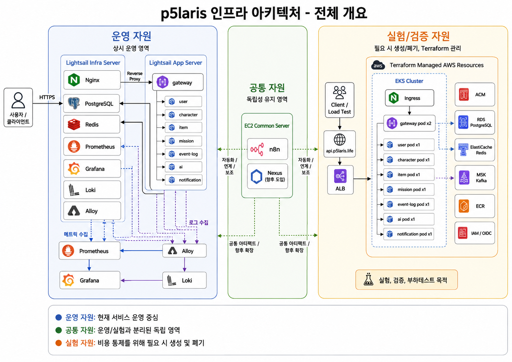
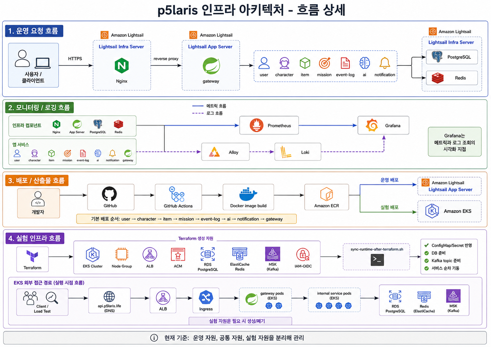
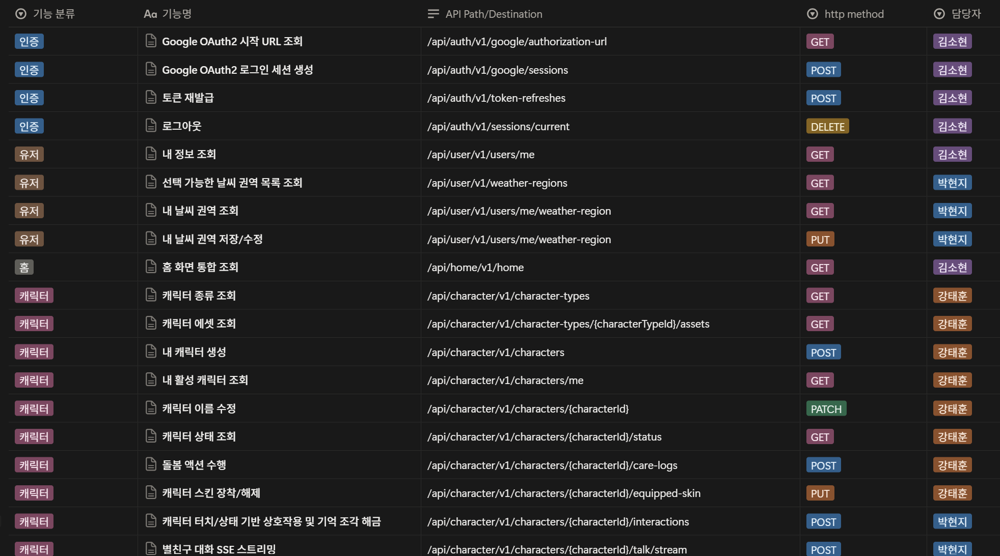
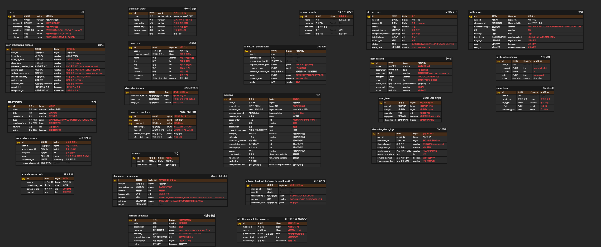

<div align="center">
  <h1 style="border-bottom: none; font-size: 2.5em; font-weight: bold;">
     Po-Polaris
  </h1>
  <p style="color: #8b949e; font-size: 1.2em; letter-spacing: 2px;">
    <b>AI CHARACTER ROUTINE MAKER (Advanced Architecture Project)</b>
  </p>
  <br />
  <hr style="background: linear-gradient(to right, transparent, #30363d, transparent); height: 1px; border: none;" />
  <br />
</div>

<p align="center">
  
  
  
  
  <br>
  
  
  
  
  <br>
  
  
  
</p>

---

## 📌 프로젝트 소개

**po-polaris**는 현재 운영 중인 상용 서비스 **Polaris**의 구조적 한계를 극복하고 대규모 트래픽 및 확장성에 대비하기 위해 진행된 **아키텍처 고도화 포트폴리오 프로젝트**입니다.

기존 라이브 서비스(운영계) 환경에서는 다운타임 위험으로 인해 시도하기 어려웠던 **모놀리식 분해(MSA 전환), 이벤트 기반 아키텍처(EDA) 도입, 부하/장애 테스트** 등의 과감한 엔지니어링 챌린지를 독립된 환경에서 실험하고 검증하는 데 목적이 있습니다.

---

## 🛠 아키텍처 고도화 핵심 과제

기존 운영 환경에서 겪었던 병목과 문제점들을 다음과 같은 기술적 시도로 해결했습니다.

#### 1️⃣ MSA 분산 환경 및 gRPC 고속 통신망 구축
* **문제:** 단일 서버 내에서 AI 연산 스레드 점유로 인해 일반 API 요청까지 지연되는 병목 발생.
* **해결:** 시스템을 8개의 마이크로서비스로 분리(AI, Mission, User 등)하여 부하를 격리하고, 내부 통신은 REST 대신 HTTP/2 기반의 **gRPC**를 채택해 고속 바이너리 직렬화 통신망을 구축했습니다.

#### 2️⃣ 분산 트랜잭션 유실 방지 (Kafka & Outbox Pattern)
* **문제:** 미션 완료 시 포인트(별조각)를 지급하는 과정에서 네트워크 장애 발생 시 데이터가 유실되거나 보상이 중복 지급되는 현상.
* **해결:** 메인 비즈니스 로직과 이벤트 발행을 분리하여 **Apache Kafka** 메시지 브로커를 도입했습니다. 로컬 DB 기반의 **Outbox Pattern**과 `Idempotency-Key` 검증을 적용해 Eventual Consistency(최종 일관성)와 멱등성을 완벽히 보장했습니다.

#### 3️⃣ 대규모 부하 시뮬레이션 및 장애 복원력 (Resilience)
* **문제:** 트래픽 스파이크 시 외부 결제 API나 AI API 지연이 전체 시스템의 장애로 전파(Cascading Failure).
* **해결:** 런칭 전 예상되는 트래픽을 **k6**를 이용해 시뮬레이션(Stress/Load Test)했습니다. 외부 API 구간에는 **Resilience4j**를 이용해 서킷 브레이커(Circuit Breaker)를 설정함으로써 시스템의 내결함성을 확보했습니다.

#### 4️⃣ 실시간 LLM 스트리밍 최적화 (SSE)
* **문제:** 캐릭터 AI와의 대화 시 LLM 응답 대기 시간이 길어 유저 경험이 크게 저하됨.
* **해결:** 생성형 AI 응답 체계를 **SSE(Server-Sent Events)** 기반 단방향 스트리밍으로 전면 개편하여 지연 없이 즉각적으로 글자가 타이핑되는 딥톡 환경을 구현했습니다.

#### 5️⃣ 무결성 기반 인앱 결제 (PortOne)
* **해결:** 포트원(PortOne) 결제 솔루션을 연동하며, Webhook 위변조 검증과 DB Lock을 결합한 멱등성 로직을 구현하여 캐시 충전 생태계의 안전성을 극대화했습니다.

---

## 👥 팀소개

| 이름  | 역할 | 담당                                                               |
|-----|----|------------------------------------------------------------------|
| 김소현 | 팀장 | 결제 시스템(PortOne) 연동, Kafka 이벤트 브로커, k6 부하 테스트 및 장애 복원력 검증 |
| 성기찬 | 팀원 | MSA 인프라 분리, gRPC 공통 모듈, CI/CD 자동화     |
| 박현지 | 팀원 | Gemini 기반 AI 프롬프트 엔지니어링, SSE 스트리밍 통신 개편, Kafka 이벤트 브로커      |
| 강태훈 | 팀원 | 캐릭터 상태 머신 로직 고도화, 테스트 코드 작성, Kafka 이벤트 브로커                  |


### [📎프로젝트 브로셔 바로가기](https://app.notion.com/p/37cad743b3ce8066847ec69e802c7af9)

---

## ⏲️ 개발기간 (고도화 프로젝트)
- 2026.05.12(화) ~ 2026.06.22(월)

---

## 🧩 Architecture (MSA)

<p align="center">
  
</p>
<p align="center">
  
</p>

---

## 🔧 Technologies & Tools

#### 🖥️ Backend Stack
<p align="left">
  
  
  
  
  
</p>

#### 💾 Data & Infrastructure
<p align="left">
  
  
  
  
</p>

#### 🤖 AI & External API
<p align="left">
  
  
  
</p>

#### 🧪 Quality & DevOps
<p align="left">
  
  
  
  
  
  
  
  
</p>

---

## 🚀 서비스 비즈니스 기능

고도화된 인프라 위에서 구동되는 메인 도메인 기능들입니다. 기존 MVP 모델에서 확장된 다양한 비즈니스 로직을 포함하고 있습니다.

#### 👤 맞춤형 온보딩 및 회원 관리
- **라이프스타일 프로파일링:** `OnboardingProfile`을 통해 유저의 수면 패턴, 직업, 관심사를 수집하여 초개인화된 미션 추천의 토대 마련.
- **데일리 리텐션 유도:** `AttendanceRecord` 기반의 연속 출석 체크 시스템 및 누적 보상 지급 로직.

#### 🎯 동적 미션 체계 & 인증 로직
- **컨텍스트 맞춤 미션 할당:** 시간, 날씨, 유저 성향에 맞춘 데일리 미션 자동 생성 및 상태 관리.
- **대화형 결과 인증:** 단순 버튼 클릭이 아닌, 수행 내용에 대한 `MissionCompletionAnswer` 제출 시 AI가 내용의 적절성을 판별해 피드백(`MissionFeedback`) 제공.

#### 👾 캐릭터 육성 및 딥톡 (Deep Talk)
- **실시간 호감도 & 상태 머신:** 쓰다듬기, 간식 주기 등 돌봄 액션(`CharacterCareLog`)에 따라 포만감과 애정도가 실시간으로 증감.
- **성장형 해금 스토리:** 캐릭터 레벨업 및 친밀도 달성에 따라 캐릭터별 고유한 숨겨진 스토리 조각(`CharacterStoryFragment`) 순차적 언락.
- **페르소나 유지 대화:** `pgvector` 기반 장기기억 RAG 검색과 SSE 스트리밍을 통해 끊김 없이 캐릭터와 일관된 페르소나로 대화.

#### 💳 경제 시스템 및 인앱 상점
- **별조각 순환 생태계:** 미션 성공, 출석, 공유를 통한 재화 획득과 인앱 상점에서의 소모 과정(`StarPieceTransaction`).
- **아이템 및 스킨 인벤토리:** 획득한 별조각으로 돌봄용 소모성 아이템 구매 및 커스텀 스킨 장착 기능.
- **PortOne 결제 연동:** 외부 결제 솔루션 API와 연동된 안전하고 멱등성 있는 캐시 결제 및 구매 내역 검증.

#### 📣 푸시 알림 및 바이럴 공유 기능
- **스마트 푸시 시스템:** 유저별 방해금지 시간(`NotificationSetting`)에 연동되어 최적의 타이밍에 발송되는 FCM 맞춤형 푸시 메시지.
- **SNS 렌더링 공유:** S3 Presigned URL을 통해 미션 달성 증명 및 캐릭터 육성 상태를 카드 형태로 렌더링하고, 인스타그램 등 외부 SNS 공유 시 리워드(`ShareLog`)를 지급하는 바이럴 시스템.

#### 📜 행동 분석 통합 로깅
- 미션 수행, 결제, 공유 등 유저의 주요 행동 이벤트를 도메인 로직과 완벽히 분리. 
- 비동기로 수집된 이벤트를 `event-log` 모듈로 적재하여 향후 A/B 테스트 및 코호트 분석 기반 구축.

---

## 🖼 API 명세서

<p align="center">
  
</p>

보다 자세한 API 명세서는
[📎API Spec](docs/sa-docs/01-API-spec.md) 에서 확인할 수 있습니다.

---

## 🗄 ERD Diagram

<p align="center">
  
</p>

보다 자세한 ERD는
[📎ERD Data Model](docs/sa-docs/02_ERD_Data_Model.md) 에서 확인할 수 있습니다.

---

## 📈 프로젝트 파일 구조 (멀티 모듈)

```text
src/
├── 📂 gateway              # REST API 진입점, JWT 글로벌 검증, gRPC 클라이언트 분산 라우팅
├── 📂 user                 # 회원 온보딩, 지갑(별조각), PortOne 결제 처리 및 멱등성 검증 로직
│   ├── 📂 core             # 인증/인가 인터페이스 및 공통 비즈니스 예외 처리
│   ├── 📂 domain           # 비즈니스 핵심 영역 (엔티티, Outbox Pattern 로직)
│   ├── 📂 infrastructure   # 외부 API 구현체 및 Kafka Producer/Consumer 연동
│   └── 📂 resources        # Flyway DB 마이그레이션 스크립트
├── 📂 character            # 상태 머신 기반 돌봄 액션, 벡터 DB 쿼리, 장착형 스킨 비즈니스
├── 📂 mission              # 유저 미션 라이프사이클 처리 및 AI 결과 피드백 보상 트랜잭션
├── 📂 item                 # 상점 인벤토리 조회 및 소모성 아이템 동시성 제어 로직
├── 📂 ai                   # Gemini 연동 프롬프트 엔지니어링, SSE 스트리밍 통신망 구현
├── 📂 notification         # FCM 토큰 발급 및 카프카 이벤트 구독을 통한 스마트 푸시 발송
├── 📂 event-log            # 통합 로그 비동기 적재 서버
├── 📂 proto                # gRPC 통신을 위한 Protocol Buffers 인터페이스 중앙 집중형 관리
└── 📂 common               # 공통 Error Handler, Response DTO, 유틸리티 로직 모음
```

---
