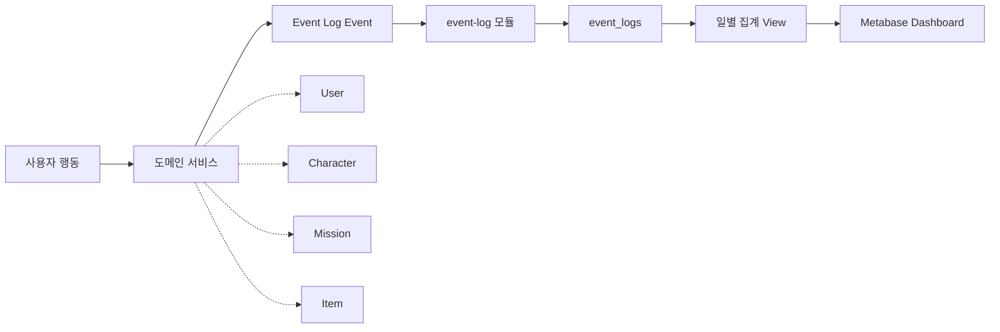

# Metabase 비즈니스·마케팅 모니터링

> Polaris의 사용자 행동 이벤트를 `event-log` 저장소에 통합하고, Metabase에서 일별 유입·활성·공유·상점 지표를 확인할 수 있도록 구성한 비즈니스 모니터링 문서입니다.

---

## 1. 도입 배경

Polaris는 캐릭터 성장, 미션 수행, 아이템 구매, 공유 보상처럼 여러 모듈이 하나의 사용자 경험을 구성합니다.

서비스가 정상적으로 동작하는지만 보는 기술 모니터링과 별개로, 운영·마케팅 관점에서는 다음 질문에 빠르게 답할 수 있어야 합니다.

- 신규 사용자가 실제 핵심 행동까지 도달하는가?
- 온보딩 이후 캐릭터 생성과 미션 수행으로 이어지는가?
- 공유카드 생성이 실제 공유 완료로 전환되는가?
- 아이템 구매와 고유 구매자 수가 유지되는가?
- 특정 이벤트나 배포 이후 DAU와 공유 지표가 개선되는가?

이를 위해 이벤트 로그를 PostgreSQL에 저장하고, Metabase에서 비개발자도 조회 가능한 대시보드로 구성합니다.

현재 구현은 로그인 사용자 중심의 서버 이벤트를 기준으로 집계합니다. 비로그인 유입, UTM 캠페인, 기기·화면별 세분화는 `anonymous_id`, `context_json`, 공유 클릭 이벤트 저장이 보강된 뒤 확장할 수 있습니다.

---

## 2. 전체 구조



도메인 서비스는 사용자 행동이 발생하면 Event Log 이벤트를 생성합니다.

`event-log` 모듈은 gRPC `recordEventLog` 요청을 받아 중앙 `event_logs` 테이블에 저장합니다. 이후 Metabase는 운영 DB에 직접 복잡한 조인을 반복하지 않고, 일별 집계 View를 읽어 비즈니스 지표를 시각화합니다.

현재 레포에는 Metabase 컨테이너와 운영 datasource 설정 파일은 포함되어 있지 않습니다. 대신 대시보드 import 템플릿과 API import 스크립트가 포함되어 있어, Metabase 서버와 DB 연결이 준비되면 동일한 비즈니스 대시보드를 재생성할 수 있습니다.

---

## 3. 데이터 수집 기준

### 중앙 이벤트 테이블

`event_logs`는 비즈니스 이벤트를 하나의 형태로 저장합니다.

| 컬럼 | 의미 | 활용 |
| --- | --- | --- |
| `event_id` | 이벤트 고유 ID | 중복 저장 방지 |
| `event_type` | 사용자 행동 종류 | 퍼널·전환율 기준 |
| `source_service` | 이벤트 발생 모듈 | 모듈별 이벤트 필터 |
| `user_id` | 로그인 사용자 ID | DAU, 고유 사용자 수 |
| `anonymous_id` | 비로그인·기기 식별자 | 가입 전 유입 분석 확장 |
| `ref_type`, `ref_id` | 참조 도메인 객체 | 미션·아이템·공유 대상 추적 |
| `properties_json` | 이벤트 상세 속성 | 카테고리, 보상, 채널 분석 |
| `context_json` | 화면·기기·환경 정보 | 플랫폼·버전별 분석 확장 |
| `occurred_at` | 실제 발생 시각 | 일별·시간대별 집계 |
| `created_at` | DB 저장 시각 | 수집 지연 확인 |

`event_id`에는 Unique 제약이 있어 같은 이벤트가 재전송되어도 중복 저장을 막을 수 있습니다.

### 현재 집계 View

현재 `event-log` 모듈에는 Metabase에서 바로 사용할 수 있는 일별 View가 정의되어 있습니다.

| View | 목적 |
| --- | --- |
| `v_daily_user_activity` | DAU, 신규 가입자, 핵심 행동 사용자 |
| `v_daily_mission_funnel` | 온보딩, 캐릭터 생성, 미션 제안·거절·완료 |
| `v_daily_share_store_activity` | 공유카드 생성, 공유 완료, 아이템 구매 |

현재 View의 `active_date`는 `occurred_at`을 단순 날짜로 변환한 값입니다. `event-log`는 gRPC Timestamp를 UTC 기준 `LocalDateTime`으로 저장하므로, 한국 운영일 기준 리포트가 필요하면 View에서 KST 기준 business date로 변환해야 합니다.

---

## 4. Metabase 대시보드 구성

### 대시보드/컬렉션 이름

```text
📊 Polaris 반짝 분석실
🌟 Polaris 한눈에 보는 성장 리포트
```

영문 부제가 필요한 자료에서는 `Polaris Business & Marketing Overview`를 함께 사용할 수 있습니다.

[(Metabase 전체 대시보드 첫 화면: 상단 KPI 카드와 주요 차트가 함께 보이는 화면)]

### 필터 구성

| 필터 | 타입 | 적용 대상 |
| --- | --- | --- |
| `start_date` | Date | 조회 시작일 |
| `end_date` | Date | 조회 종료일 |
| `event_type` | Category | 이벤트 상세 분석 |
| `source_service` | Category | 모듈별 이벤트 분석 |

Metabase SQL 질문에서는 `{{start_date}}`, `{{end_date}}` 같은 변수를 사용해 날짜 필터를 연결합니다.

---

## 5. 핵심 지표 카드

### 1. 오늘의 서비스 활성 지표

목적: 마케팅 유입과 실제 활동 규모를 한 화면에서 확인합니다.

[(DAU, 신규 가입자, 핵심 행동 사용자 KPI 카드가 보이는 화면)]

```sql
SELECT
    dau AS "DAU",
    new_users AS "신규 가입자",
    core_action_users AS "핵심 행동 사용자"
FROM v_daily_user_activity
WHERE active_date = CURRENT_DATE;
```

해석:

- `DAU`가 유지되는데 `core_action_users`가 낮으면 사용자가 접속만 하고 주요 기능까지 가지 못한 상태입니다.
- `new_users`가 증가했는데 다음 날 DAU가 따라오지 않으면 온보딩 또는 첫 경험 전환을 점검해야 합니다.

---

### 2. 일별 활성 사용자 추이

목적: 캠페인, 배포, 이벤트 이후 사용자 활동량 변화를 추적합니다.

```sql
SELECT
    active_date,
    dau,
    new_users,
    core_action_users
FROM v_daily_user_activity
WHERE active_date BETWEEN {{start_date}} AND {{end_date}}
ORDER BY active_date ASC;
```

시각화:

- Line Chart
- `dau`, `new_users`, `core_action_users` 3개 선 비교

마케팅 활용:

- 서비스 이벤트나 배포 전후의 신규 가입자 증가 확인
- 신규 유입 대비 핵심 행동 전환 여부 확인
- 특정 배포 이후 활동량 하락 감지

UTM 캠페인별 성과를 직접 비교하려면 공유 클릭, 가입 전 유입 이벤트, `context_json` 또는 `properties_json`에 캠페인 식별자를 저장하는 보강이 필요합니다.

---

### 3. 온보딩·미션 퍼널

목적: 사용자가 가입 후 핵심 경험까지 도달하는 흐름을 확인합니다.

```sql
SELECT
    active_date,
    onboarding_completed_events,
    character_created_events,
    mission_offered_events,
    mission_completed_events,
    mission_rejected_events
FROM v_daily_mission_funnel
WHERE active_date BETWEEN {{start_date}} AND {{end_date}}
ORDER BY active_date ASC;
```

시각화:

- Funnel
- Stacked Bar
- Line Chart

해석:

- 온보딩 완료 대비 캐릭터 생성이 낮으면 첫 캐릭터 생성 UX를 점검합니다.
- 미션 제안 대비 완료가 낮고 거절이 높으면 미션 난이도나 추천 품질을 점검합니다.
- 미션 완료가 늘면 캐릭터 성장 경험에 도달한 사용자가 늘어난 것으로 볼 수 있습니다.

---

### 4. 공유 완료·보상 획득 전환 흐름

목적: 공유카드 생성이 보상 처리 대상 공유 완료 기록으로 이어지는지 확인합니다. 공유 보상 획득은 별도 `SHARE_REWARD_CLAIMED` 이벤트가 아니라 `SHARE_COMPLETED.properties_json.rewardEarned = true` 기준으로 집계합니다.

```sql
SELECT
    share_store.active_date,
    share_store.share_card_created_events,
    share_store.share_completed_events,
    COALESCE(reward_daily.reward_earned_events, 0) AS reward_earned_events,
    CASE
        WHEN share_store.share_card_created_events = 0 THEN 0
        ELSE ROUND(
            share_store.share_completed_events::numeric
            / share_store.share_card_created_events * 100,
            2
        )
    END AS share_completion_rate,
    CASE
        WHEN share_store.share_completed_events = 0 THEN 0
        ELSE ROUND(
            COALESCE(reward_daily.reward_earned_events, 0)::numeric
            / share_store.share_completed_events * 100,
            2
        )
    END AS reward_earned_rate
FROM v_daily_share_store_activity share_store
LEFT JOIN (
    SELECT
        DATE(occurred_at) AS active_date,
        COUNT(*) FILTER (
            WHERE properties_json ->> 'rewardEarned' = 'true'
        ) AS reward_earned_events
    FROM event_logs
    WHERE event_type = 'SHARE_COMPLETED'
    GROUP BY DATE(occurred_at)
) reward_daily
    ON reward_daily.active_date = share_store.active_date
WHERE share_store.active_date BETWEEN {{start_date}} AND {{end_date}}
ORDER BY share_store.active_date ASC;
```

시각화:

- Combo Chart
- 카드 생성·공유 완료는 막대
- 전환율은 선 그래프

운영 활용:

- 공유 UI 개선 전후 공유 완료율과 보상 획득률 비교
- 공유 보상 정책 변경 후 공유 완료 기록 변화 비교
- 외부 플랫폼 공유 장애 여부 감지

[(공유와 확산 리포트: 공유카드 생성, 공유 완료, 보상 획득률 카드 또는 차트가 보이는 화면)]

주의:

현재 공유 로그 구현은 같은 날 첫 보상 대상 공유 기록을 중심으로 관리합니다. Metabase에서는 `SHARE_COMPLETED` 이벤트의 `rewardEarned` 속성으로 보상 획득 여부를 구분합니다. 같은 날 두 번째 이후의 모든 공유 시도를 완전한 이벤트 로그로 수집하려면 공유 시도 이벤트와 일일 보상 지급 이벤트를 분리해 저장하는 보강이 필요합니다.

또한 `SHARE_COMPLETED`는 외부 사용자가 공유 링크를 클릭했다는 의미가 아니라, 로그인 사용자가 공유 완료 API를 호출해 보상 처리 흐름에 진입했다는 의미입니다. 실제 바이럴 유입 전환을 보려면 공유 클릭 이벤트를 `event-log`에 저장해야 합니다.

---

### 5. 상점 구매 활동

목적: 아이템 구매와 고유 구매자 흐름을 확인합니다.

```sql
SELECT
    active_date,
    item_purchased_events,
    unique_buyers
FROM v_daily_share_store_activity
WHERE active_date BETWEEN {{start_date}} AND {{end_date}}
ORDER BY active_date ASC;
```

시각화:

- Bar Chart
- Line Chart

해석:

- 구매 건수는 유지되는데 고유 구매자 수가 줄면 소수 유저에게 구매가 집중된 상태입니다.
- 고유 구매자와 구매 건수가 함께 하락하면 아이템 매력도, 보상 지급량, 상점 진입 UX를 함께 점검합니다.

---

### 6. 공유·상점 통합 요약

목적: 소셜 전파와 인앱 소비가 함께 움직이는지 확인합니다.

[(별조각과 상점 리포트: 별조각 흐름, 상점 구매, 고유 구매자 차트가 보이는 화면)]

```sql
SELECT
    active_date,
    share_card_created_events AS "공유카드 생성",
    share_completed_events AS "공유 완료",
    item_purchased_events AS "아이템 구매",
    unique_buyers AS "고유 구매자"
FROM v_daily_share_store_activity
WHERE active_date BETWEEN {{start_date}} AND {{end_date}}
ORDER BY active_date ASC;
```

활용:

- 공유가 늘어난 뒤 아이템 구매가 증가하는지 확인
- 공유 완료와 상점 구매가 함께 증가하는지 간접 확인
- 공유 완료의 `rewardEarned` 속성과 상점 이벤트를 같은 화면에서 비교

---

## 6. 운영 해석 가이드

| 현상 | 가능한 원인 | 확인할 지표 |
| --- | --- | --- |
| 신규 가입은 증가했지만 DAU 유지 실패 | 온보딩 이후 첫 경험 약함 | `new_users`, `dau`, `character_created_events` |
| 온보딩 완료 후 캐릭터 생성이 낮음 | 캐릭터 생성 화면 이탈 | `onboarding_completed_events`, `character_created_events` |
| 미션 제안 대비 완료가 낮음 | 미션 품질·난이도 문제 | `mission_offered_events`, `mission_completed_events`, `mission_rejected_events` |
| 공유카드 생성 대비 공유 완료 기록이 낮음 | 공유 UI, 공유 완료 API 호출 실패, 보상 매력도 문제 | `share_card_created_events`, `share_completed_events` |
| 아이템 구매자 수 하락 | 상점 상품 매력도 저하 또는 재화 부족 | `item_purchased_events`, `unique_buyers` |

---

## 7. 현재 구현 기준의 한계

### Metabase 설정 파일

레포 안에는 Metabase 컨테이너와 운영 datasource 설정 파일은 포함되어 있지 않습니다. 대신 다음 import용 파일이 포함되어 있습니다.

```text
docs/metabase/METABASE_POLARIS_DASHBOARD_IMPORT.json
docs/metabase/import-metabase-polaris-dashboard.mjs
docs/metabase/METABASE_DASHBOARD_JSON_IMPORT_GUIDE.md
```

event-log, users, ai DB와 일별 집계 View를 Metabase에 연결하고, import 템플릿으로 비즈니스 대시보드를 재생성할 수 있도록 구성했습니다.

[(Metabase 데이터베이스 연결 목록: Polaris Event Log, Polaris User Analytics, Polaris AI Analytics 3개 DB가 연결된 화면)]

### 이벤트 발행 범위

현재 코드에서 발행 경로가 확인되는 이벤트:

```text
USER_SIGNED_UP
USER_LOGGED_IN
ONBOARDING_COMPLETED
CHARACTER_CREATED
MISSION_OFFERED
MISSION_REJECTED
MISSION_COMPLETION_SESSION_STARTED
MISSION_COMPLETED
SHARE_CARD_CREATED
SHARE_COMPLETED
ITEM_PURCHASED
STAR_PIECE_SPENT
AI_FALLBACK_USED
```

공유 보상 획득은 현재 Metabase 대시보드에서 별도 `SHARE_REWARD_CLAIMED` 이벤트가 아니라 `SHARE_COMPLETED.properties_json.rewardEarned = true` 기준으로 집계합니다. `SHARE_REWARD_REQUESTED`는 `character_outbox_events`에 저장되는 보상 지급 요청 이벤트이므로, event-log 기반 사용자 행동 지표와 구분해 설명하는 것이 안전합니다.

공유 클릭 API는 `referrer`, `utmSource`, `utmMedium`, `utmCampaign`을 받지만 현재는 애플리케이션 로그만 남기고 `event-log`에는 저장하지 않습니다. 따라서 현재 대시보드는 공유 링크 클릭 수나 UTM 캠페인별 유입을 직접 보여주지 않습니다.

### 일자 기준

현재 집계 View는 다음처럼 `occurred_at`을 날짜로 변환합니다.

```sql
DATE(occurred_at) AS active_date
```

`event-log`는 gRPC Timestamp를 UTC 기준 `LocalDateTime`으로 변환해 저장합니다. 한국 시간 기준 운영 리포트를 만들려면 View에서 다음처럼 KST 기준 날짜를 별도로 계산하는 것이 안전합니다.

```sql
DATE(occurred_at AT TIME ZONE 'UTC' AT TIME ZONE 'Asia/Seoul') AS active_date
```

현재 지표는 “현재 View 기준 일별 지표”이며, 운영 화면에서는 UTC/KST 기준을 명시합니다.

### 분석 이벤트의 전달 보장

분석 이벤트 전달 방식은 모듈마다 다릅니다. User와 Item 이벤트는 Outbox를 거쳐 재시도될 수 있고, Character, Mission, AI 이벤트는 도메인 트랜잭션 커밋 후 비동기 gRPC로 `event-log`에 전달됩니다.

전송 실패가 핵심 비즈니스 로직 실패로 전파되지는 않지만, 모든 분석 이벤트의 최종 전달을 보장하는 것은 아닙니다.

운영 지표 정확도를 더 높이려면 다음 보강이 필요합니다.

- 분석 이벤트 전용 Outbox 적용 범위 확대
- Event Log 전송 실패 재처리
- `source_service`, `event_type` 표준 사전 관리
- Metabase dashboard import/export 파일 관리
- 운영 datasource 권한을 읽기 전용 계정으로 제한

---

## 8. 요약

### 제목

**비즈니스 지표를 개발자 없이 확인하는 Metabase 대시보드**

### 문제

> 서비스 로그는 쌓이고 있었지만, 운영·마케팅 담당자가 신규 유입, 핵심 행동, 공유 전환, 아이템 구매 흐름을 한 화면에서 확인하기 어려웠습니다.

### 해결

> 사용자 행동 이벤트를 `event-log` 모듈의 `event_logs`에 통합 저장하고, 일별 집계 View와 import 템플릿을 Metabase에 연결해 DAU, 온보딩 퍼널, 공유 완료·보상 획득률, 상점 구매 지표를 대시보드로 확인할 수 있게 구성했습니다.

### 결과 카드

```text
Event Log 중앙 저장
PostgreSQL View 기반 집계
Metabase Business Dashboard
DAU · Funnel · Share Completion · Reward Earned Rate
Business Activity Insight
```

## 관련 구현

```text
event-log/src/main/resources/db/migration/V1__init.sql
event-log/src/main/java/p5laris/eventlog/domain/application/EventLogService.java
proto/src/main/proto/event_log/v1/event_log_service.proto
docs/metabase/METABASE_POLARIS_DASHBOARD_IMPORT.json
docs/metabase/import-metabase-polaris-dashboard.mjs
docs/metabase/METABASE_DASHBOARD_JSON_IMPORT_GUIDE.md
```
